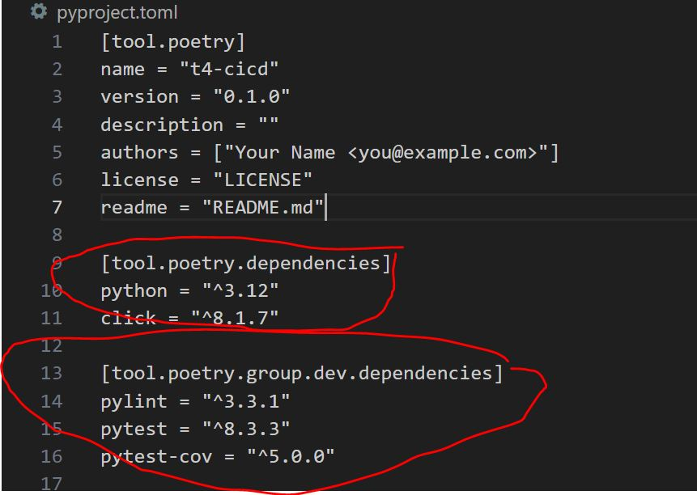

# T4-CICD Project

Project to build a CI/CD System.

# Installation Instruction

Reference for Poetry and Click [here](https://medium.com/@chinsj/develop-and-deploy-cli-tool-on-python-with-poetry-and-click-ab62f4341c45)

## Prerequisite:

0. Installed Python 3.12 from official [website](https://www.python.org/downloads/)
1. Installed pipx and poetry

```shell
# Install pipx
python -m pip install --user pipx
python -m pipx ensurepath

# Then go to your environment variable on windows/OS, check the path added and
# update lowercase to uppercase if necessary
# restart your window/OS.

# installation of poetry using pipx
pipx install poetry
```

2. Activated Virtual Environment

```shell
# navigate to the project directory
# First create your virtual environment using venv,
# Give it a name like myenv, if you use other name, add it to the .gitignore file
# venv come with standard python package
python -m venv myenv

# Activate your virtual environment. For bash terminal
source <your_venv_dir>/Scripts/activate
# Example when you name venv as myenv
source myenv/Scripts/activate
```

## Installation, Lint & Test

```shell
# This will install all dependencies, and the project itself into your venv
poetry install

# Run pylint for src directory, --fail-under score to be 10
poetry run pylint ./src --fail-under=10

# Run pytest with coverage, note current passing coverage score is set at 50%
poetry run pytest
```

## Development - Managing Dependencies

[Reference](https://python-poetry.org/docs/managing-dependencies/#installing-group-dependencies) for dependencies management.

Remember to check the pyproject.toml file to ensure the dependency is added/removed



```shell
# Adding new dependency for general
poetry add <dependency/lib/package>

# Adding new dependency for development environment only
poetry add <dependency/lib/package> --group dev

# Remove dependencies
poetry remove <dependency/lib/package>
# Remove dependencies from development environment
poetry remove <dependency/lib/package> --group dev
```

## Development - Using Logging

Steps:

- Get logger from util.common_utils get_logger() function
- supplied arguments if required
- By Default a debug.log file will be created at project root directory, you can change its location.
