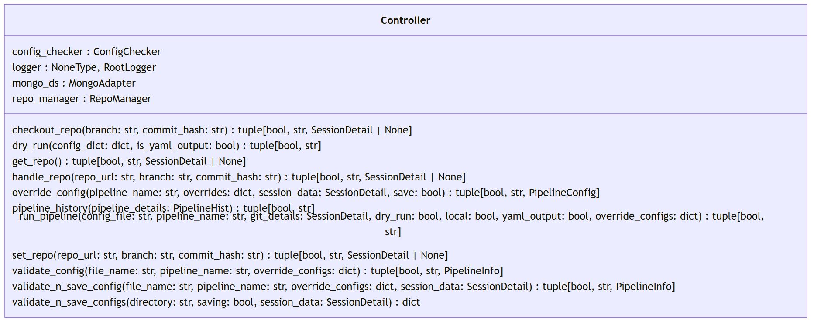
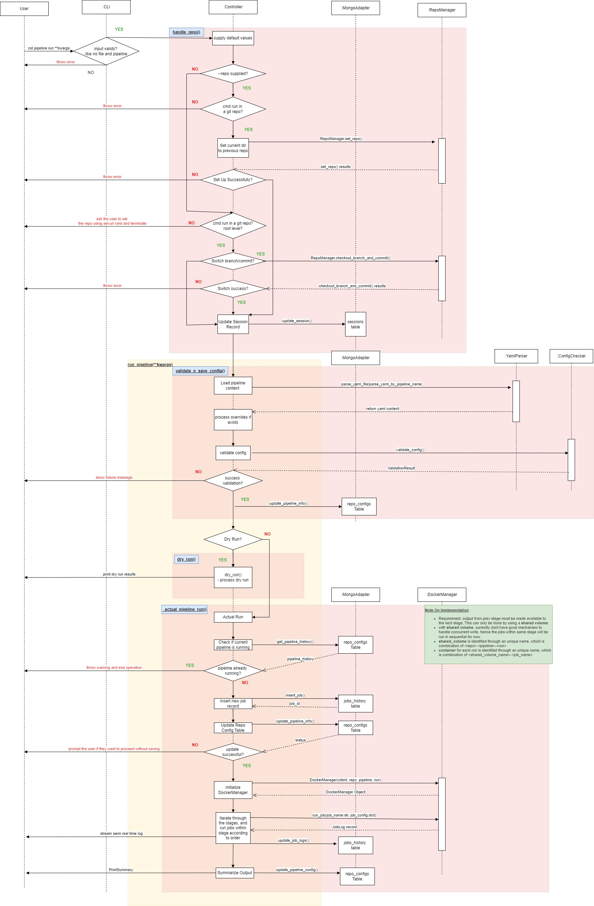
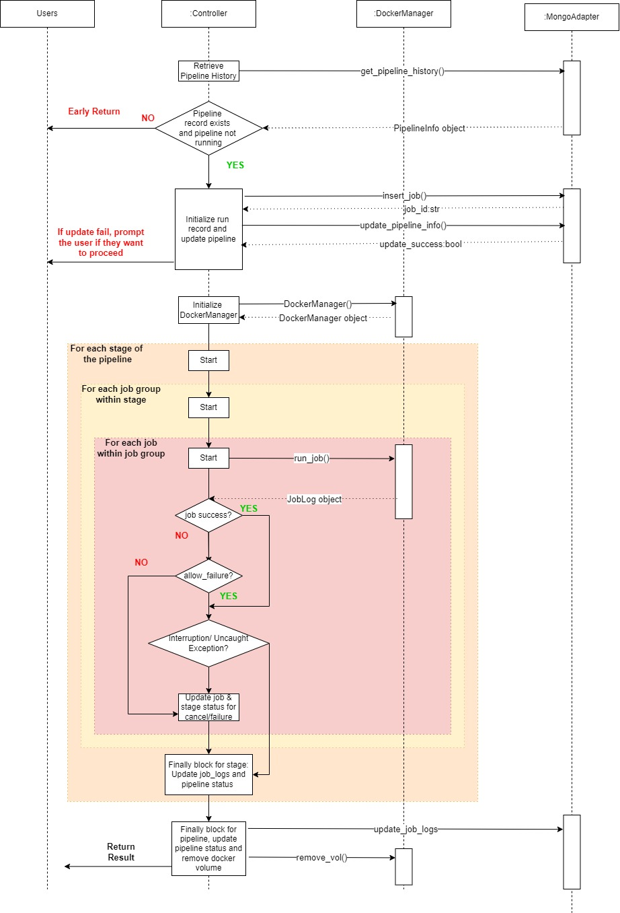

# Component Design Description

This project is structured into three main packages that live `./src`

**Cli:** Handles all command-line interface functionality.

**Controller:** Implements the core system logic interaction with external services.

**Util:** Provides utility modules and shared functionality that support the cli and controller

## Cli Package

This package contains the cli functions developed using Click. Main command groups are cid config and cid pipeline. Kindly refer to the cli documentations and api documentation for more details.

## Controller Package

### Controller Module

The controller has the following main methods as shown in the UML diagram, they are described below:

#### Repository Management:

These methods manage repository operations based on the context and input provided through the CLI.

`handle_repo()`: Determines which operation to execute:

- If --repo is provided, calls `set_repo()` to clone the repository.
- If branch/commit is provided, calls `checkout_repo()` to update the current repository in $PWD.
- If neither is provided, calls `get_repo()` to use the repository in `$PWD` or suggests the last session repository.

#### `set_repo()`

- The `$PWD` must be empty before cloning.
- Clones a repository into the current working directory and optionally checks out a branch and/or commit.
- Defaults to the main branch and the latest commit if branch, commit not given
- If inputs are invalid, the method exits without changes

#### `checkout_repo()`

- Ensures inputs are valid and `$PWD` is a valid repository.
- This method updates the repository in the current working directory to a specified branch and/or commit. It supports checking out:
- Local branches: Uses existing tracking branches.
- Remote branches: Fetches updates for branches not tracked locally and creates a corresponding local branch.
- Remote references: Programmatically fetches changes for untracked origins, creates a local branch, and fast-forwards it to match the remote state.
- Defaults to the current branch if branch not given. Uses latest commit if no commit given.

#### `get_repo()`

- Uses the current working directory as the repository if it is valid.
- If `$PWD` is not a repository, retrieves the last successfully used repository from the session state and prompts the user with options to continue using it or specify a different repository.

#### Pipeline Runs:

These methods manage the execution flow of pipelines based on the provided context and inputs:

#### `run_pipeline()`

- Refer the example sequence diagram for the summarized sequence flow of `run_pipeline()` method.
- This method handle the cid pipeline run command after setting up the repository using the `handle_repo()` method.
- The next step is check if there is any overrides, and apply the overrides using the `apply_overrides()` method from common_utils module.
- Then it will validate and save the updated pipeline configuration using `validate_n_save_config()` method
- If dry-run flag is provided, it will call the `dry_run()` function to print out the example dry_run sequence.
- For actual run, the private method `_actual_pipeline_run()` will be called.
- A MongoAdapter class object (mongo_ds) will be used to interact with the MongoDB service.

#### `dry_run()`

- `dry_run()` method is simply reading the configuration file that is converted into `dict` type (in our case, `OrderedDict`) to preserve the steps order of execution and then print it to the console
- this uses the `common_utils.DryRun` class that returns a string when called. This functions are `get_plaintext_format` and `get_yaml_format()`
- controller return the `dry_run_msg` to the cli and display it to user.

#### `_actual_pipeline_run()`

- This method performs actual run of the pipeline when called. Refer to the sequence diagram for illustration of flow.
- It requires 3 arguments,
  - repo_data:SessionDetail, contain repository information required to interact with the MongoDB.
  - pipeline_config:PipelineConfig, valid pipeline configuration.
  - local:bool, indicator if the pipeline to be run in local.
- remote pipeline run is currently not implemented, hence local=False will still run using local service by default.
- This method will first retrieve the pipeline history from the MongoDB, break and return early if the same pipeline is already and still running.
- If the pipeline can be run, a new pipeline run record will be initialized and inserted into the MongoDB, and current pipeline status will be updated to active.
- it will then create a DockerManager object, using the default docker engine from the user's IDE environment, and creating a shared volume with name of the following syntax `<repo_name>-<branch>-<pipeline_name>-<run_number>`. This will ensure the shared volume is unique within the user's IDE environment.
- The stages for a single pipeline run will be iterated according to order.
  - for each stage, the jobs will be iterated according to order specified. Parallel run of job is not implemented.
  - for each job, the DockerManager `run_job()` method will be called to execute the pipeline run. If artifact section is present for the job, the `run_job()` method will handle upload of the artifact to the AWS S3.
  - logs for each job are displayed to the user as soon as the job finished.
  - if the job failed, the next job will proceed if the allow_failure flag is set. Otherwise the execution of the entire pipeline will break.
  - if KeyboardInterruption is encountered, the job status will be updated to cancel. Stage status is updated accordingly.
  - at the end of each stage, the Finally block tallies the stage completion status based on all jobs status, and the job_logs for the entire stage are updated to the MongoDB.
- At the end of all stage, the Finally block tallies the pipeline completion status based on all stages status. The pipeline status and history is updated to the MongoDB.
- The Docker shared volume created early is also removed in the Finally block.

#### Configuration Files:

These methods handle pipeline configuration files, either individually or for an entire directory.

#### `validate_config()`, `validate_n_save_config()`, `validate_n_save_configs()`

- These three methods handle different scenarios for validating the pipeline configuration. They all use the ConfigChecker class object to perform the actual validation.
- The `validate_config()` method can apply overrides and validate a single pipeline configuration without saving it into MongoDB. This is used when the users just want to validate a single pipeline configuration.
- The `validate_n_save_config()` method use the `validate_config()` method and add the functionality to save the validated configuration into the datastore.
- The `validate_n_save_configs()` method handle pipeline configuration validation for the entire directory.
  - No override is applied.
  - An optional saving flag can be used to save all pipeline configuration into the datastore.
  - The validation process will not stop when validation fail for a single pipeline configuration, it will continue until all pipelines are validated.

#### pipeline_history()

- `pipeline_history()` receives user query to retrieve pipeline report they have previously done using `cid pipeline run`. This function receives one argument:
  - `PipelineHist` is a Pydantic Model that contains repo_name, pipeline_name, run number, etc.
- Given the flags given by the user, it will go to the conditional statement (L4.1 Show all Summary, L4.2 pipeline Run Summary, L4.3 Show Stage Summary, L4.4 Show Job Summary)
  - based on the number of arguments given (ex `pipeline_name, repo, job_name, stage_name`) retrieve the data in Mongo using `mongo.get_pipeline_run_summary()`
- return the string of the output message by calling a helper function called `PipelineReport.print_job_summary()`

## Util Package

This package contains all the utility modules required to support the controller package. Kindly refer to the API documentation for more details.

## Example Sequence Diagram

## Suplement Information

### List of external libraries used

| Library       | Usage                                                                                                    | Scope       |
| ------------- | -------------------------------------------------------------------------------------------------------- | ----------- |
| gitpython     | Programmatic interaction with Git for all git operations                                                 | Production  |
| pymongo       | Programmatic interaction with MongoDB for all datastore operation                                        | Production  |
| python-dotenv | Reads key-value pairs from a .env file and can set them as environment variables                         | Production  |
| pathlib       | Resolve directory and file path for different OS                                                         | Production  |
| ruamel-yaml   | Parse yaml content from file                                                                             | Production  |
| docker        | Python docker sdk for programmatic interaction with docker engine                                        | Production  |
| pydantic      | Provide parsing and validation capabilities for input data to ensure the fields conform to specific type | Production  |
| pylint        | Perform static code analysis and style check following PEP 8.                                            | Development |
| pytest        | Perform unit testing                                                                                     | Development |
| pytest-cov    | Analyse unit tests and provide test coverage report                                                      | Development |
| mongomock     | Provide a mock MongoDB instance used for testing                                                         | Development |
| pydoctor      | Generate API documentations from docstring                                                               | Development |

For more details like version etc, kindly refer to the pyproject.toml file

### Pydantic Model vs Dict

- pydantic model is used as much as we can after we start adopting it halfway during the development [ref](https://docs.pydantic.dev/1.10/usage/models/)
- dictionary is used for raw pipeline configuration extracted from yaml files. This is to preserve the line and column information for error tracings.

### Details for Testing

Kindly refer to the TestingReadMe file.
