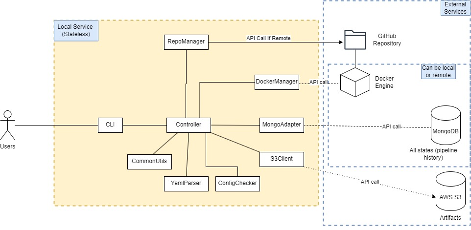

# Overall System Design

## Requirements and Main Usecase

The requirements of this system came from the [Project Requirements](https://neu-seattle.gitlab.io/asd/cs6510f24/CS6510-F24/main/project/requirements.html).

The main usecase is to serve as a CI/CD system integrating with customer infrastructure for a small/medium sized company with about 100 - 200 developers.

## High Level System Architecture

## Main Component Description

The main components are separated into two groups.

The first group of components are packaged together as a **CLI application** developed using Python. The CLI application must be installed on the users IDE environment (local/remote ssh session).
These components include:

- **CLI** module - handling commands entered by the users
- **Controller** module - receive inputs from the cli module, and coordinates method calls with other modules to perform required operations
- **RepoManager** module - handle operations in verifying current repository information or setting up the repository based on given details. Perform API/HTTP requests to GitHub services if required
- **DockerManager** module - handle operations involving Docker Engine. Perform inter-process call to Docker Engine.
- **MongoAdapter** module - handle all datastore operations related to pipeline histories. Perform API/HTTP call to MongoDB services. Note the CLI application itself is stateless (it will not remember input of previous commands), the application is relying on the MongoDB as datastore to store all the state information such as
  - previous repository used by the users,
  - pipeline configurations saved for the repository,
  - history of previous pipeline runs, and
  - whether the current pipeline is still running etc.
- **S3Client** module - handle upload artifacts to remote location. Perform HTTP call to AWS S3 services.
- **ConfigChecker** module - performs pipeline configuration validation.
- **YamlParser** module - parse the pipeline configuration from target yaml files.
- **CommonUtils** module - provide other utility functions shared with other modules.

&nbsp;

The second group of components are **external services** required to support the CLI application. These include:

- **GitHub** service - provided and managed by GitHub. Fully remote and no concern on scaling on the customer end.
- **Docker Engine** service - can be local or remote. This service is connected using the docker.from_env() method ([Ref](https://docker-py.readthedocs.io/en/stable/#getting-started)) which use the default socket or configuration set in the developer's IDE environment.
- **MongoDB** service - can be local (using MongoDB Community Server hosted locally) or remote (hosted by MongoDB Cloud Atlas or company's dedicated service links). The connection url need to be set by the users (refer to README).
- **AWS S3** service - provided and managed by Amazon Web Services. Users will need to set the AWS credentials and settings accordingly in their environment (refer to README).

## Flow of Communication Description

- The flow of communication started when users enter a valid cli commands in their IDE.
- The commands will be handled by the cli module, which determine which methods in the controller to call.
- The controller methods will handle the logic of coordinating method calls to utility modules to perform the required operation.
- Each utility modules may call the external services through API/HTTP requests if required, and return the results back to the controller methods.
- The controller methods will aggregate the results and send back to the cli module.
- The cli module will handle most of the output display to the users.

## Design Rationale

Based on the main usecase and requirements, the team decided to package all non-external service modules into a **single CLI application** with the following rationale:

- For users, it is easy to install and set up the CLI application. The application can be installed using standard pip install command.
- For developers, it would be easier to develop and test the CLI application in a single package. Integration tests between various components can be set up easily.

### Alternative Design Considered

The main alternative design that the team has considered is to use a client-server architecture similar to diagram below.

This design has the **potential benefits** of

- Less workload on client end as the bulk of operations are moved to the server side
- Easier scaling on the server side to handle more client calls

However, the design also has the following **drawbacks**:

- There is one extra server component that need to be maintained and kept up and running for 24/7 for the whole CI/CD system to function.
- Addition of API/HTTP calls increase chances of communication breakdown, which complicated the development process and may affect users experience.

It is still possible to scale with our current design to handle the workload required by the customer company as:

- The CLI application is lightweight and can be installed in local IDE environment. Thus each users will use their own copy of the CLI application to run the CI/CD process as required. And with the advance of modern computing resources, each users' IDE should have enough computing power to run the CLI application seamlessly for their own use.
- The external services can be scaled easily when required. Some of the external services (like GitHub and AWS S3) are managed by external service provider, which the company dont need to worry about the scaling issues.

At such, we decided to go with the current design.

## Remarks

For more details description of each components, and example sequence diagrams for an actual command, refer to the ComponentDesign.md file.
