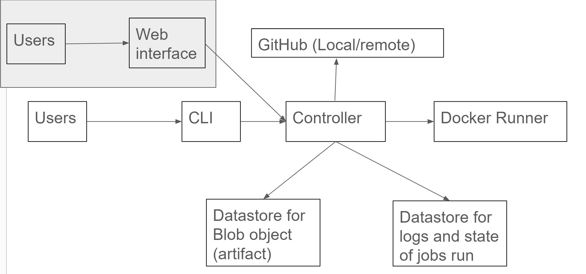
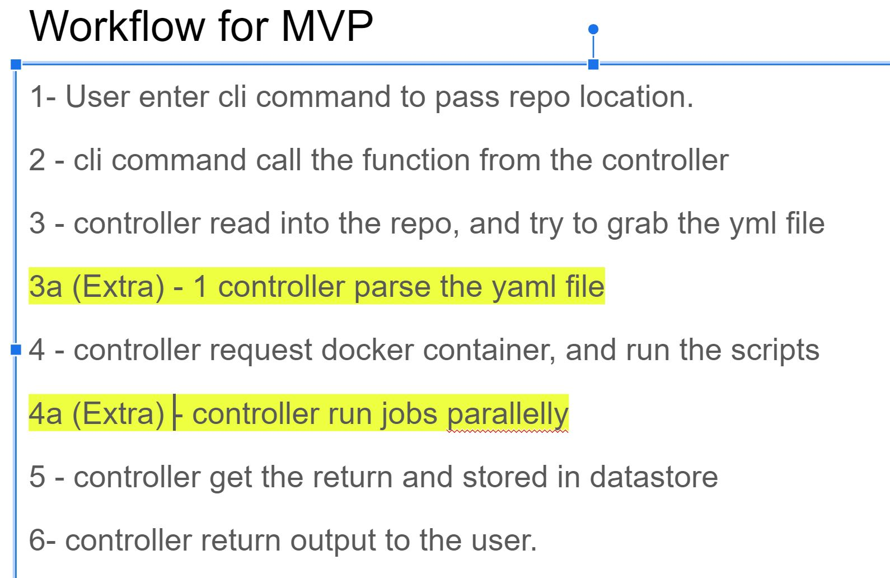
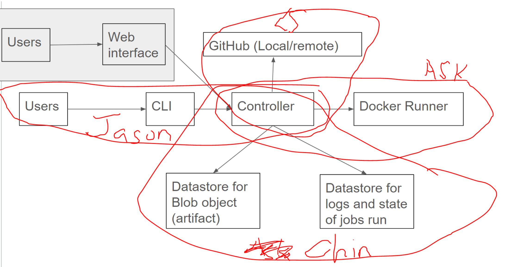

# Week 4 (Oct 1 - Oct 8)

# PLACEHOLDERS ARE BELOW, WILL UPDATE ACCORDINGLY:

## Summary

We had a meeting on Sept 27 to go through and aligned on the

- expected final product,
- project set up tools to used,
- common working practise (like coding style, PR practise, Lint & Test check etc),
- High Level System Design
- A mininum viable product (MVP) which contains the barebone of the simple basic function we tried to achieve by next week based on the workflow
- Initial distribution of tasks

This week meeting chairperson & report writer - Chin
Next week meeting chairperson - Akshay

# Completed tasks

| Task                     | Weight     | Assignee |
| ------------------------ | ---------- | -------- |
| #2 Initial Project Setup | S - 1 days | Chin     |

# Carry over tasks

| Task                                                                                                                                                                  | Weight       | Assignee |
| --------------------------------------------------------------------------------------------------------------------------------------------------------------------- | ------------ | -------- |
| #4 Update High Level System Design & Tech Stack Selection                                                                                                             | S - 1 days   | Akshay   |
| #6 Define CLI commands/args available for client to use                                                                                                               | S - 1 days   | Jason    |
| #6 Design the first controller class and add initial set of commands to trigger the first workflow                                                                    | M - 2/3 days | Jason    |
| Create functions with associated class to read the files in the given Github repository, locate the target yml file and extract its content ready for parsing         | M - 2/3 days | Peihsuan |
| #10 Create functions with associated classes to run a predefined docker container with preset scripts, and capture the output from the docker container run           | M - 2/3 days | Akshay   |
| #8 Create two functions with associated classes to create and read data into MySQL server (for blob object storage) and MongoDB server (for other documents and logs) | M - 2/3 days | Chin     |
| #9 Create two functions with associated classes to create and read data into the MongoDB server (for other documents and logs)                                        | M - 2/3 days | Chin     |
| Initial design for Data Storage Schemes                                                                                                                               | S - 1 days   | Chin     |

# New tasks

| Task | Weight | Assignee |
| ---- | ------ | -------- |
|      |        |          |

# What worked this week?

- We leverage some of the team member (Chin / Jason) experiences in setting up the Python Project and also GitHub Project tracker.
- We have defined the communication channel and location (days/hours) to meet for standup and weekly meeting, which gives us time to share our progress and keep us accountable.

# What did not work this week?

- We had new team member this week and spent some time in helping new member up to speed with what we previously discussed before.
- The ignore file path for build_test to main doesn't work. It's not currently needed for now as we haven't develop any code, but we will implement it in the future.

# Design updates

High Level System Design

Workflow for a very simple product we want to achieve before end of next week

Initial Distribution of tasks

