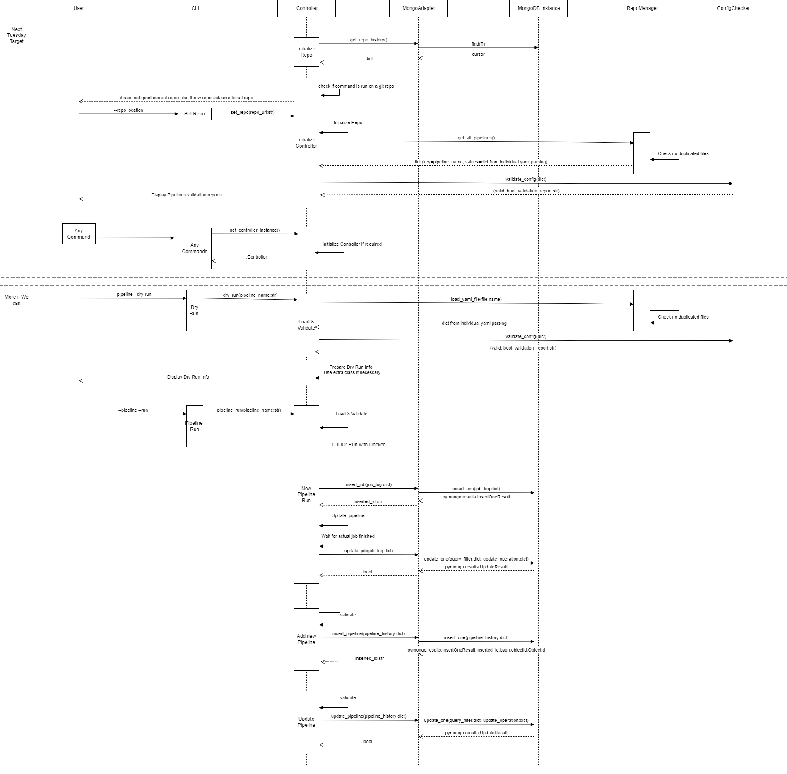
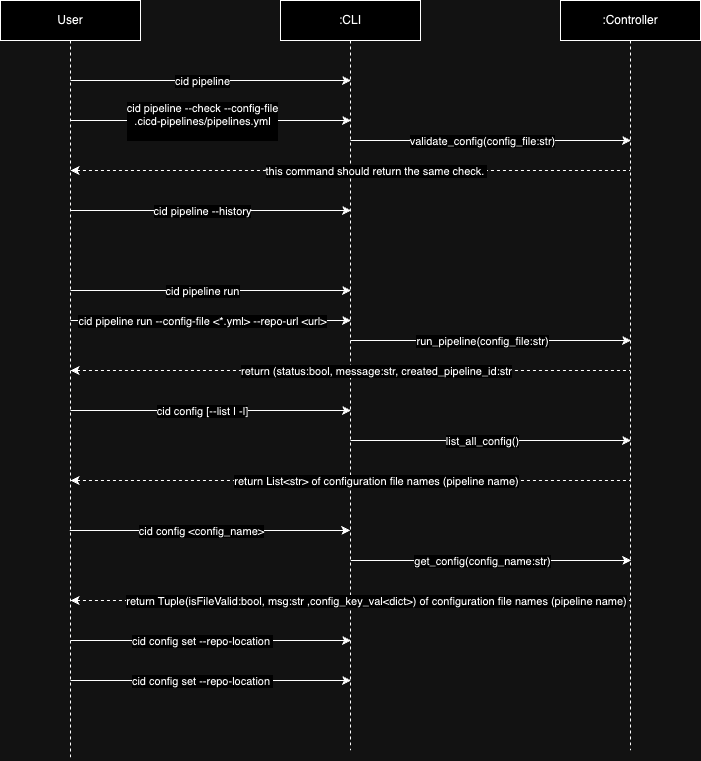

# Week 5 (Oct 8 - Oct 12)

## Summary

Meeting on 8th and 11th October to monitor and tackle issues. Following are notes from meeting:

- Shifted focus from building the MVP to preparing for the demo next week.
- Discussed and divided the tasks related to additional files and methods needed for [Requirement 2](https://neu-seattle.gitlab.io/asd/cs6510f24/CS6510-F24/main/project/requirements.html#_requirements_iteration_2).
- Clarified the workflow from the CLI Controller to handling repository and configuration file checks.
- Aligned on the API for Controller and ConfigChecker.
- Clarified the differences in the CLI for Base Command, Config Management, and Pipeline Management.

We decided to do a team code walk on 14th on our development branch to make sure the uses case will be well presenting on class.

This week meeting chairperson & report writer - Peihsuan

Next week meeting chairperson - Jason

# Completed tasks

| Task                                                                                   | Weight     | Assignee |
| -------------------------------------------------------------------------------------- | ---------- | -------- |
| [#37](https://github.com/CS6510-SEA-F24/t4-cicd/issues/37) [System Design] - Draft Sequence Diagram to shows interaction flow between modules | S - 1 days | Chin     |
| [#31](https://github.com/CS6510-SEA-F24/t4-cicd/issues/31) [Config] Define pipeline.yml syntax requirement and expected validation output     | S - 1 days | Chin     |
| [#34](https://github.com/CS6510-SEA-F24/t4-cicd/issues/34) [CLI] Implement Test cases for Barebone CLI | S - 1 days | Jason     |
| [#43](https://github.com/CS6510-SEA-F24/t4-cicd/issues/43) [CLI] Draft Sequence Diagram for CLI subcommand to get the flow to Controller | XS - 0.5 days | Jason |
| [#24](https://github.com/CS6510-SEA-F24/t4-cicd/issues/24)[CLI] Create Barebone CLI Interface Structure | XS - 0.5 days | Jason

# Carry over tasks

| Task                                                                                                                                                        | Weight       | Assignee |
| ----------------------------------------------------------------------------------------------------------------------------------------------------------- | ------------ | -------- |
| #4 Update High Level System Design & Tech Stack Selection                                                                                                   | S - 1 days   | Akshay   |
| #6 [Epic] Define CLI commands / args available for client | M - 2/3 days | Jason    |
| #10 Create functions with associated classes to run a predefined docker container with preset scripts, and capture the output from the docker container run | M - 2/3 days | Akshay   |
| #27 Add sample interaction CRUD functions with MySQL                                                                                                        | M - 2/3 days | Chin     |
| #38 [Config] Implement Config Checker for pipeline content validation with job cycle detection                                                              | M - 2/3 days | Chin     |
| Initial design for Data Storage Schemes                                                                                                                     | S - 1 days   | Chin     |

# New tasks / Backlog

| Task | Weight | Assignee |
| ---- | ------ | -------- |
| [Controller] Define / Implement a Base Controller #15 | M | Jason |
| [CLI] implement validation (try/catch) for user input | XS | Jason |

# What worked this week?

- Chin : interaction diagram and design doc to align everyone's understanding on the same page.
- Jason: the diagram that Chin created really helped me and the team to align what to deliver on Tuesday. 
- Jason: Breaking down the task and communicate my struggle to the team seem to do help me move forward and deliver the code,test,design (sequence diagram) for this sprint.

# What did not work this week?

- Chin : Before the interaction diagram was drafted, everyone has their own understanding on how the system should run. Furthermore, previous discussions were not documented and the discussions kind of recycling itself.
- Jason : helping a team member to align with the current design and to start implementing takes longer than expected.

# Design updates

### System Integration Diagram by Chin

### Initial CLI v0.1 Sequence Diagram for available commands
