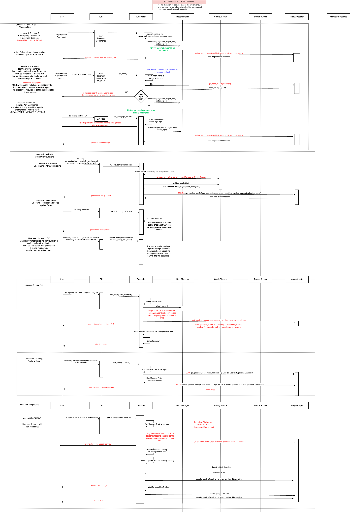

# Week 6 (Oct 13 - Oct 19)

## Summary

This sprint we focus on meeting the Requirement - Iteration 2 for our first code walk. We did the meeting on Monday 10/14 instead of Tuesday to make sure the code works. and on the 10/18 to discuss updated design decision based on feedback.

We added [Issue #62](https://github.com/CS6510-SEA-F24/t4-cicd/issues/62) to track the feedback from other teams, Professor, and from our observation what the other team did well.

Following are notes from meeting:

- Design Docs are created to centralize our design decision and be the discussion points during the weekly meeting discussion.
- We took a step back to review our high level design diagram, relook at how we store and manage the state (history of users interaction). List potential approaches for moving forward and their respective pros and cons,
  and agree on a way forward.
- Based on past few weeks experiences, we decided to try a new approach in tackling the remaining requirements. We defined the use cases based on the requirements.
  - This allows one developer develop the solutions from end to end,
  - with minimal requirement to wait or align with others,
  - while allowing he/she to gain better understanding on what is required between each components involved in his usecase.
  - he/she will also have a better anticipation of what is expected in upcoming week, so if the developer finish the target on this week, he/she can start working on next week target to complete the usecase.
  - this allows the developer to develop the codes in his/her own pace, reduce the pressures of other's people work depends on their work which may force them to develop under time pressure.
- While these use cases may have dependency on the other previous use cases, the previous use cases can be replaced with stub until they are ready.
- Added several use cases that we defined and want to prioritize as a team to achieve. Ideally to have 2 out of 4 use cases are delivered. But we aim to show one complete usecases, with parts of other usecases, including an successful interaction with the datastore on next demo. The use cases is defined from the new system*integration_diagram*\*.png that is added below the #Design Updates section.
- Archive/Delete no longer relevant / outdated issues from GitHub tracker. This is to help us focus on the new design. So you may see some carry over tasks that got deleted/renamed.

This week meeting chairperson & report writer - Jason

Next week meeting chairperson - Chin

# Completed tasks

| Task                                                                                                                                                                                | Weight       | Assignee      |
| ----------------------------------------------------------------------------------------------------------------------------------------------------------------------------------- | ------------ | ------------- |
| [Config] Implement Config Checker for pipeline content validation with job cycle detection [#38](https://github.com/CS6510-SEA-F24/t4-cicd/issues/38)                               | M - 2/3 days | Chin          |
| [Design] Update High Level Design Diagram to incorporate the local/server design. This should include defining REST API. [#64](https://github.com/CS6510-SEA-F24/t4-cicd/issues/64) | M - 2/3 days | Jason -> Chin |
| [Design] Initial design for Data Storage Schemes                                                                                                                                    | XS - 2-3 hrs | Chin          |

# Carry over tasks

| Task                                                                                                                                                                                | Weight       | Assignee    |
| ----------------------------------------------------------------------------------------------------------------------------------------------------------------------------------- | ------------ | ----------- |
| [CLI] define & implement cid pipeline --dry-run [#33](https://github.com/CS6510-SEA-F24/t4-cicd/issues/33)                                                                          | M - 2/3 days | Jason       |
| [Yaml] Resolve Pyyaml silently overwrite duplicate keys instead of reporting it [#45](https://github.com/CS6510-SEA-F24/t4-cicd/issues/45)                                          | S - 1 day    | Lin -> Chin |
| [ConfigChecker] Add flexible method to extract any yaml file given the absolute path [#56](https://github.com/CS6510-SEA-F24/t4-cicd/issues/56)                                     | S - 1 day    | Chin        |
| [Design] Update High Level Design Diagram to incorporate the local/server design. This should include defining REST API. [#64](https://github.com/CS6510-SEA-F24/t4-cicd/issues/64) | M - 2/3 days | Chin        |
| [RepoManager] refactor RepoManager & ConfigChecker to stick to single responsibility principle for yml extraction [#68](https://github.com/CS6510-SEA-F24/t4-cicd/issues/68)        | S - 1 day    | Lin -> Chin |
| [CLI] Update CLI documentation [#67](https://github.com/CS6510-SEA-F24/t4-cicd/issues/67)                                                                                           | S - 1 day    | Akshay      |

# New tasks / Backlog

| Task                                                                                      | Weight       | Assignee |
| ----------------------------------------------------------------------------------------- | ------------ | -------- |
| [SystemDesign] Standardize and document the error handling and logging behaviour #41      | M - 2/3 days | TBD      |
| [CLI] Update CLI documentation [#67](https://github.com/CS6510-SEA-F24/t4-cicd/issues/67) | S - 1 day    | Akshay   |
| L4.1.Show summary all past pipeline runs for a repository[#55](https://github.com/CS6510-SEA-F24/t4-cicd/issues/55) | S - 1 day | TBD |
| Implement use case 1 - get & set working repo | L - 1 week | Akshay |
| Implement use case 2 - Validate Pipeline Configurations | L - 1 week | Chin |
| Implement use case 3 - dry run command | L - 1 week | Jason |
| Implement use case 4 - change config values via cli | L - 1 week | Lin |

# What worked this week?

- Jason: the code walk opens up new perspective on how well we have done as a team up to this point.

# What did not work this week?

- Jason: spent more time to redesigning the components because it's not working as we planned, such as Controller singleton.
- Jason: I have emergency issues that took me away from this project for a day.

# Design updates

Local / Server design that describes the high level architecture of the current components we have.

divide the sequence diagram into several use cases for each devs to pick up and execute.

