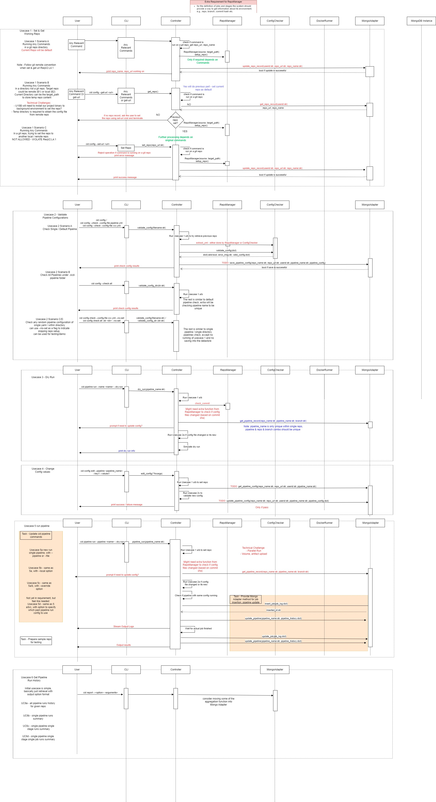

# Week 7 (Oct 20 - Oct 26)

## Summary

This sprint we continue to focus on meeting the Requirement - Iteration 2 for our second code walk and work after. We did the meeting on Tuesday to make sure the code works. and on the 10/25 to sync up the progress and plan the work for next few weeks to complete the Minimum Viable Product.

Following are notes from meeting:

- We review the feedback received from codewalk 2, and take note for improvement if necessary.
- We have map the remaining requirements from the project to the remaining usecases (see [here](https://docs.google.com/document/d/11vtyOegsum96iRzlGtGfWXBteygTPRqG/edit?usp=drive_link&ouid=112126218933969906699&rtpof=true&sd=true) for the full mapping), and created the issues.
- We went through the scope of works for each remaining issues, and distribute them among ourselves for the coming 2-3 weeks. The distribution follows the following principal
  - Maximize the output for the team by
  - Taking consideration of who is good at what, and what other team members can do. So one person does not necessary take the task that he can do best, but he/she will be assigned the task that is suitable to left for him/her. For example, member A might be best at task 1 and good at task 2, but if member B can only do task 1 and really bad at task 2, then the better distribution will be member B take task 1 and member A take task 2.
- By distributing the tasks we also identify the owners for each part of the codes/designs. Future changes will require owner for input.
  - Database adapter and schemes - Lin
  - YamlParser, ConfigChecker, DockerRunner - Chin
  - cid pipeline commands - Jason
  - cid config commands and repo manager - Akshay
- The team also agreed to step up test code coverage effort to protect the codes we written before and automate most of the testing.

This week meeting chairperson & report writer - Chin

Next week meeting chairperson - Akshay

# Completed tasks

| Task                                                                                                                                                                                | Weight       | Assignee    |
| ----------------------------------------------------------------------------------------------------------------------------------------------------------------------------------- | ------------ | ----------- |
| [Yaml] Resolve Pyyaml silently overwrite duplicate keys instead of reporting it [#45](https://github.com/CS6510-SEA-F24/t4-cicd/issues/45)                                          | S - 1 day    | Lin -> Chin |
| [ConfigChecker] Add flexible method to extract any yaml file given the absolute path [#56](https://github.com/CS6510-SEA-F24/t4-cicd/issues/56)                                     | S - 1 day    | Chin        |
| [Design] Update High Level Design Diagram to incorporate the local/server design. This should include defining REST API. [#64](https://github.com/CS6510-SEA-F24/t4-cicd/issues/64) | M - 2/3 days | Chin        |
| [RepoManager] refactor RepoManager & ConfigChecker to stick to single responsibility principle for yml extraction [#68](https://github.com/CS6510-SEA-F24/t4-cicd/issues/68)        | S - 1 day    | Lin -> Chin |
| [Database] Design Initial Database Schemes [#23](https://github.com/CS6510-SEA-F24/t4-cicd/issues/23)                                                                               | S - 1 day    | Chin        |
| [CLI] Update CLI documentation [#67](https://github.com/CS6510-SEA-F24/t4-cicd/issues/67)                                                                                           | S - 1 day    | Akshay      |
| [CLI] Usecase 3: Integrate CLI with MongoAdapter cid pipeline run --dry-run <config_file> [#33](https://github.com/CS6510-SEA-F24/t4-cicd/issues/33)                                | M - 2/3 days | Jason       |
| [CLI] Set Repo for CID service [#69](https://github.com/CS6510-SEA-F24/t4-cicd/issues/69)                                                                                           | L - 1 week   | Akshay      |
| [CLI] Usecase 4: Allow CLI to Override Keys in CI/CD Configuration [#70](https://github.com/orgs/CS6510-SEA-F24/projects/8?pane=issue&itemId=84050684&issue=CS6510-SEA-F24%7Ct4-cicd%7C70) | L - 1 week | Lin |

# Carry over tasks

| Task                                                                                                                                                 | Weight        | Assignee |
| ---------------------------------------------------------------------------------------------------------------------------------------------------- | ------------- | -------- |
| [CLI] define & implement cid pipeline --dry-run [#33](https://github.com/CS6510-SEA-F24/t4-cicd/issues/33)                                           | M - 2/3 days  | Jason    |
| [UC1-CLI&RepoManager] Options for Branch & Commit [#83](https://github.com/CS6510-SEA-F24/t4-cicd/issues/83)                                         | M - 2/3 days  | Akshay   |
| [Pytest] improve test coverage for cmd & controller [#82](https://github.com/CS6510-SEA-F24/t4-cicd/issues/82)                                       | M - 2/3 days  | Lin      |
| [UC5] MongoAdapter methods for docker run operation [#90](https://github.com/CS6510-SEA-F24/t4-cicd/issues/90)                                       | M - 2/3 days  | Lin      |
| [UC2 Config] Save validated config to MongoDB [#76](https://github.com/CS6510-SEA-F24/t4-cicd/issues/76)                                             | S - 1 days    | Lin      |
| [CLI] implement cid pipeline dry-run missing features [#89](https://github.com/CS6510-SEA-F24/t4-cicd/issues/89)                                     | M - 2/3 days  | Jason    |
| [UC3, UC5 CLI] Update cid pipeline run commands [#85](https://github.com/CS6510-SEA-F24/t4-cicd/issues/85)                                           | M - 2/3 days  | Jason    |
| [UC5 - Controller & Docker] Implement the methods required to run, stop, cancel pipeline [#17] (https://github.com/CS6510-SEA-F24/t4-cicd/issues/17) | L/XL - 2 week | Chin     |

# New tasks / Backlog

| Task                                                                                                                                                              | Weight       | Assignee |
| ----------------------------------------------------------------------------------------------------------------------------------------------------------------- | ------------ | -------- |
| [SystemDesign] Standardize and document the error handling and logging behaviour #41                                                                              | M - 2/3 days | TBD      |
| [UC6] Show summary all past pipeline runs for a repository[#55](https://github.com/CS6510-SEA-F24/t4-cicd/issues/55)                                              | L - 1 week   | Lin      |
| [UC2-Config] Output Format Modification and Clean Up [#80](https://github.com/CS6510-SEA-F24/t4-cicd/issues/80)                                                   | S - 1 day    | Akshay   |
| [UC1, UC2, UC3] Integrate the usecases from set repo, check config, up to dry run [#84] (https://github.com/CS6510-SEA-F24/t4-cicd/issues/84)                     | S - 1 day    | Jason    |
| [UC1, UC2, UC4] Integrate usecases from set repo, check config and override config [#88] (https://github.com/CS6510-SEA-F24/t4-cicd/issues/88)                    | S - 1 day    | Akshay   |
| [UC5 - Java Repo Sample] Create A Sample Repository with Java Project that with the cicd configuration [#86](https://github.com/CS6510-SEA-F24/t4-cicd/issues/86) | M - 2/3 days | Akshay   |
| [UC5 - Python Repo Sample] Create Sample Repo with cicd configuration for testing [#87](https://github.com/CS6510-SEA-F24/t4-cicd/issues/87)                      | M - 2/3 days | Chin     |

# What worked this week?

- Jason: Have more understanding on the pipeline dry-run and the priorities of the feature to be implemented based on the new requirement and feedback on code-walk.
- Jason: continue on assigning responsibility based on Use Case. Cleaning up the backlog and assigned requirement that is done by the chairperson this week.
- Chin: Our productivity seem to increase a bit following previous change in approach.
- Akshay: Teamwork is good, our meetings are shorter since everyone knows their tasks and everything going on
- Akshay: Communication is effective. I was able to get quick and to the point feedback with my tasks
- Lin: Assigning tasks based on use cases works well because it lets us focus on our own work and cuts down on the need to check in with each other.

# What did not work this week?

- Jason: adjusting to the new requirement increase the amount of workload for each individual.
- Chin: some of the team members are caught up by other courses workload hence we wont be able to maintain production after code walk 2
- Chin: To continue improve test coverage when developing our code.
- Akshay: Using IDE based formatter (autopep8) but it doesn't seem to be consistent throughout the team. Creates merge conflicts unnecessarily.
- Lin: Didn’t include unit tests—should've allocate more time to finish this part.
  
# Design updates

Design docs added

- CLI_Documentation.md - for all cli commands that the user can use
- designdoc_data_schemes - for database (MongoDB) scheme reference

Updated high level design

Updated sequence diagram
More details on Usecase 5 & 6 for division of scope.

